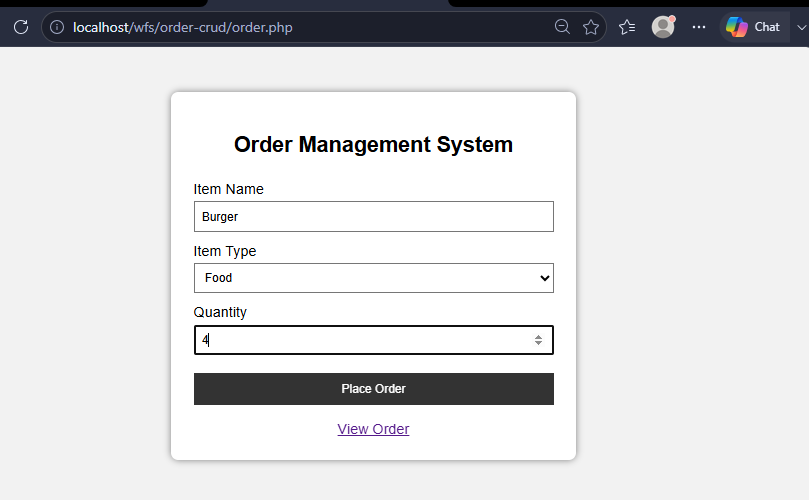
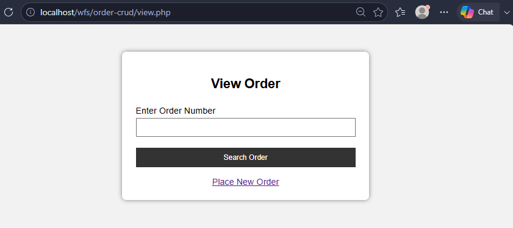
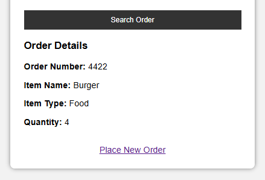

# Order Management System

A simple **Order Management System** developed using **PHP, MySQL, HTML and CSS**.

This project allows a customer to enter item information, place an order, and search/view an existing order using its order number.

The project is developed as a practical program for **Web Framework & Services (WFS)**.

---

## 📌 Practical Question

Create a web page using PHP which accepts item information such as:

- Item Name
- Item Type
- Quantity

The system should provide a facility to:

- Place an Order
- Generate an Order Number
- Display an order according to the Order Number

---

## ✨ Features

- Simple order placement form
- Item name input
- Item type selection
- Quantity input
- Automatic order number generation
- Store order details in MySQL database
- Search order using Order Number
- Display order details
- Option to place a new order
- Basic form validation using HTML
- Beginner-friendly CSS design

---

## 🛠️ Technologies Used

- **Frontend:** HTML5, CSS3
- **Backend:** PHP
- **Database:** MySQL
- **Server:** XAMPP
- **Editor:** Visual Studio Code

---

## 🖥️ Screenshots

### Place Order Form




### View Order



### Search Order Result




## 📂 Project Structure

```text
order-crud/
│
├── connect.php
├── order.php
├── view.php
├── style.css
├── README.md
│
└── screenshots/
    ├── place-order.png
    ├── view-order.png
    └── search-order.png