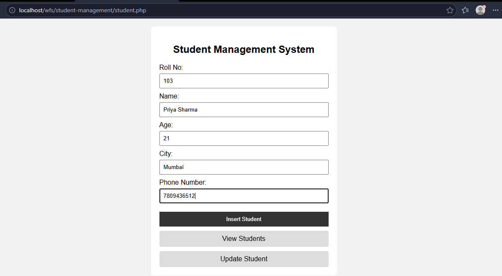
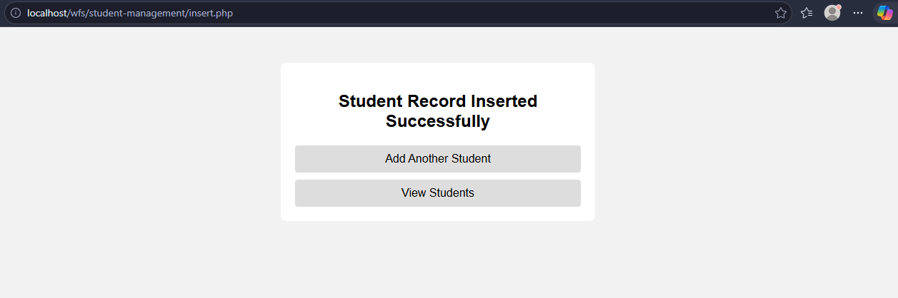
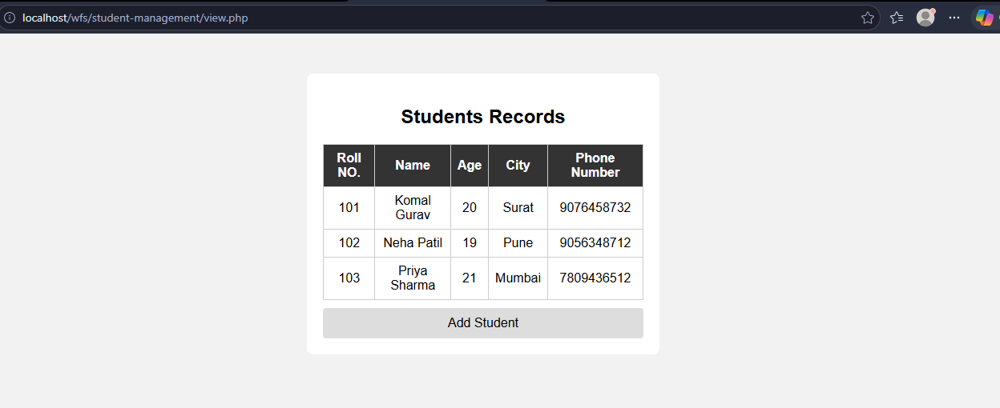
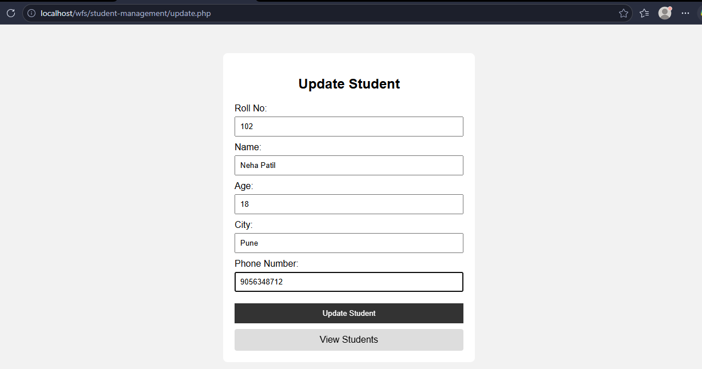

# Student Management System

A simple and beginner-friendly **Student Management System** developed using **PHP and MySQL** as part of the T.Y.B.C.A. 5th Semester Web Framework & Services practical.

The system stores student information in a MySQL database and provides options to **insert, view, and update student records by roll number**.

---

## 📌 Practical Details

- **Subject:** 504 – Web Framework & Services
- **Practical:** 3 – Student Management System
- **Technology:** PHP
- **Database:** MySQL
- **Frontend:** HTML and CSS
- **Server:** XAMPP
- **Level:** Beginner-friendly

---

## 🎯 Objective

The main objective of this practical is to create a basic web-based Student Management System that can:

1. Accept student details through a form.
2. Store student records in a MySQL database.
3. Display stored student records.
4. Update student details using the student's roll number.
5. Provide simple navigation between the pages.

---

## 🛠️ Technologies Used

| Technology | Purpose |
|------------|---------|
| PHP | Server-side programming |
| MySQL | Storing student records |
| HTML | Creating forms and page structure |
| CSS | Basic page styling |
| XAMPP | Local development server |
| phpMyAdmin | Creating and managing the database |

---

## 📂 Project Structure

```text
student-management/
│
├── connect.php
├── student.php
├── insert.php
├── view.php
├── update.php
└── style.css
```
---

## 🗄️ Database

### Database Name

`student_db`

### Table Name

`students`

### Table Fields

| Field | Data Type | Description |
|-------|-----------|-------------|
| `roll_no` | INT | Unique roll number of the student |
| `name` | VARCHAR(100) | Student name |
| `age` | INT | Student age |
| `city` | VARCHAR(100) | Student city |
| `phone_number` | VARCHAR(10) | Student phone number |

`roll_no` is used as the **Primary Key** so that each student record has a unique roll number.

---

## 🔄 System Workflow

**Student Management System**  
↓  
**student.php**  
↓  
Enter Student Details  
↓  
**insert.php**  
↓  
**MySQL Database**  
↓  
├── **view.php** → View All Records  
└── **update.php** → Update by Roll No.

---


## 🔗 Navigation

The project provides simple navigation between pages.

**student.php**  
↓  
**Insert Student → insert.php**

**student.php**  
↓  
**View Students → view.php**

**view.php**  
↓  
**Add Student → student.php**

The `update.php` page is used when student details need to be modified.

---

## ▶️ How to Run the Project

### Step 1: Start XAMPP

Open XAMPP Control Panel and start:

- Apache
- MySQL

### Step 2: Place the Project

Copy the project folder into:

`C:\xampp\htdocs\`

Example:

`C:\xampp\htdocs\student-management\`

### Step 3: Create the Database

Open phpMyAdmin:

`http://localhost/phpmyadmin`

Create the database:

`student_db`

Create the table:

`students`

with the following fields:

- `roll_no`
- `name`
- `age`
- `city`
- `phone_number`

### Step 4: Test Database Connection

Open:

`http://localhost/student-management/connect.php`

If the connection is successful, the page displays:

**Database Connected Successfully**

### Step 5: Open the Main Page

Open:

`http://localhost/student-management/student.php`

The Student Management System is now ready to use.

---

## 🧪 Testing

The following operations were tested:

- Database connection
- Student data insertion
- Viewing student records
- Updating student records using roll number
- Page navigation
- Basic CSS styling

---

## 📸 Screenshots

### 1. Student Input Form



### 2. Insert Success Message



### 3. View Student Records



### 4. Update Student Form



---

## 📚 Learning Outcomes

By completing this practical, the following concepts were practiced:

- Creating a MySQL database and table
- Connecting PHP with MySQL
- Creating HTML forms
- Receiving form data using PHP
- Inserting records into MySQL
- Retrieving records using `SELECT`
- Updating records using `UPDATE`
- Using roll number to identify a student record
- Displaying database records in an HTML table
- Applying basic CSS styling
- Creating simple navigation between PHP pages