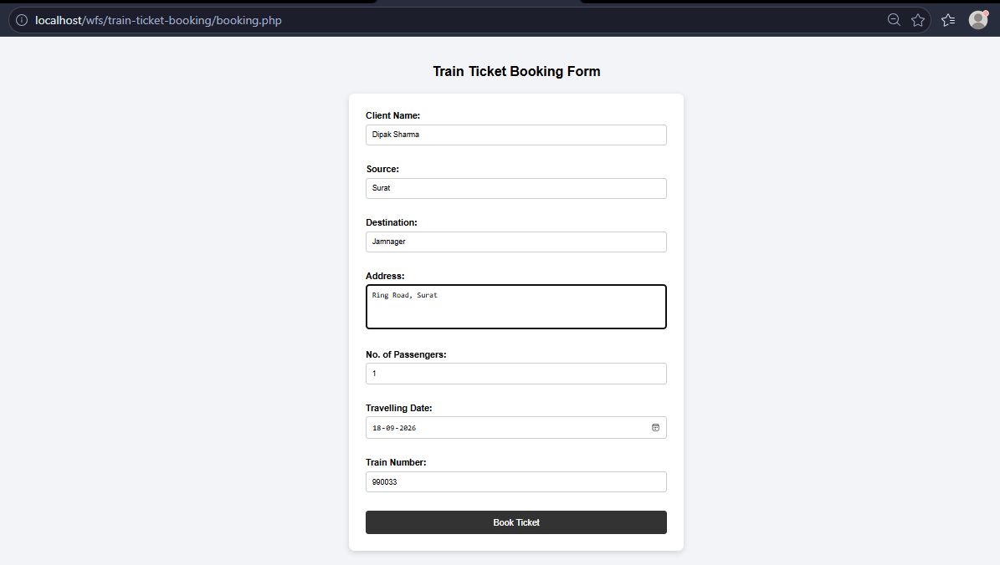
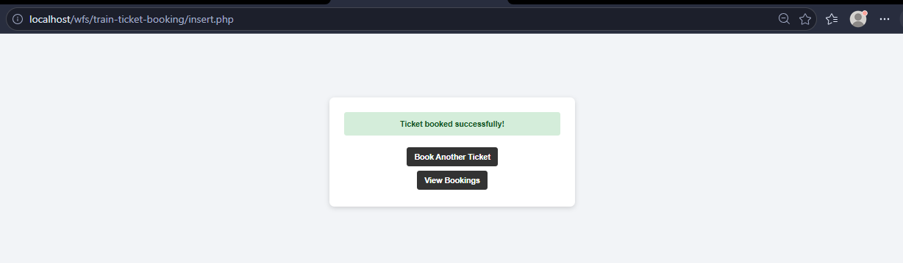
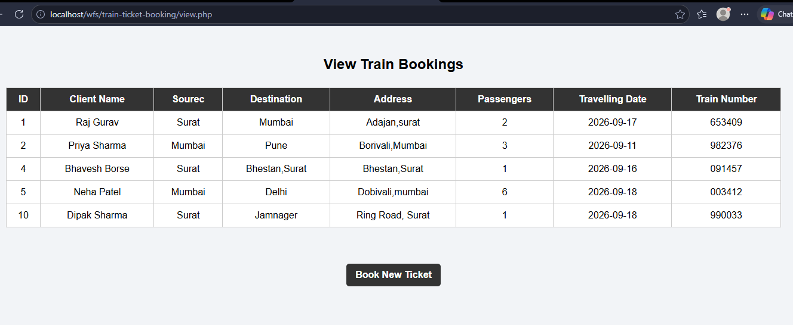

# 🚆 Train Ticket Booking System

A simple **Train Ticket Booking System** developed using **PHP and MySQL** as part of the T.Y.B.C.A. – 5th Semester **Web Framework & Services (WFS)** practical assignment.

The system allows users to enter train ticket booking details, store them in a MySQL database, and view the saved bookings.

---

## 📌 Project Overview

The Train Ticket Booking System is a PHP-based web application that allows a customer to enter ticket-booking information such as:

- Client Name
- Source
- Destination
- Address
- Number of Passengers
- Travelling Date
- Train Number

The booking information is stored in a MySQL database and can be viewed through the booking records page.

---

## ✨ Features

- Train ticket booking form
- MySQL database connectivity
- Insert booking records into the database
- View all saved bookings
- Navigation to book a new ticket
- Success and error messages
- Basic form validation
- Clean and simple CSS design
- User-friendly interface

---

## 🛠️ Technologies Used

| Technology | Purpose |
|---|---|
| PHP | Backend and form processing |
| MySQL | Database storage |
| HTML | Structure of web pages and forms |
| CSS | Styling and user interface design |
| XAMPP | Local development server |
| phpMyAdmin | Database creation and management |

---

## 📁 Project Structure

```text
train-ticket-booking/
│
├── images/
│   ├── booking-form.png
│   ├── booking-success.png
│   └── view-bookings.png
│
├── booking.php
├── connect.php
├── insert.php
├── view.php
├── style.css
└── README.md
```

---

## 🗄️ Database Structure

### Database Name

```text
train_db
```

### Table Name

```text
train_bookings
```

### Table Fields

| Field Name | Data Type | Description |
|---|---|---|
| `id` | INT | Primary key and Auto Increment |
| `client_name` | VARCHAR(100) | Name of the client |
| `source` | VARCHAR(100) | Starting location |
| `destination` | VARCHAR(100) | Destination location |
| `address` | VARCHAR(255) | Client address |
| `passengers` | INT | Number of passengers travelling |
| `travelling_date` | DATE | Date of travelling |
| `train_number` | VARCHAR(20) | Train number |

---

## 🔄 Application Workflow

```text
                 Customer
                    │
                    ▼
              booking.php
             Booking Form
                    │
                    │ Submit
                    ▼
               insert.php
            Process Booking Data
                    │
                    ▼
               connect.php
          Database Connection
                    │
                    ▼
              MySQL Database
                 train_db
                    │
                    ▼
             train_bookings
                    │
                    ▼
                view.php
           Display Bookings
                    │
                    ▼
             Book New Ticket
                    │
                    └──────────► booking.php
```

---


## ⚙️ How to Run the Project

### 1. Start XAMPP

Open XAMPP Control Panel and start:

- Apache
- MySQL

### 2. Place the Project

Place the project folder inside:

```text
C:\xampp\htdocs\wfs\
```

The final project path should be:

```text
C:\xampp\htdocs\wfs\train-ticket-booking
```

### 3. Create the Database

Open **phpMyAdmin** and create the database:

```text
train_db
```

Then create the table:

```text
train_bookings
```

Add the required fields according to the database structure given above.

### 4. Configure Database Connection

The `connect.php` file connects the PHP application with the `train_db` MySQL database.

### 5. Open the Booking Form

Open the following URL in the browser:

```text
http://localhost/wfs/train-ticket-booking/booking.php
```

### 6. Enter Booking Details

Fill in the required information and click:

```text
Book Ticket
```

The booking information will be inserted into the `train_bookings` table.

### 7. View Bookings

Open:

```text
http://localhost/wfs/train-ticket-booking/view.php
```

The saved train booking records will be displayed.

---

## 📸 Screenshots

### 📝 Booking Form



### ✅ Booking Success



### 📋 View Train Bookings



---

## 🎯 Practical Requirements Covered

The project covers the following requirements:

- Accept train ticket booking information
- Store booking information using MySQL
- Insert records into the database
- Display saved booking records
- Provide navigation options
- Apply basic form validation
- Use CSS for a clean user interface

---

## 🔐 Validation

The booking form uses basic HTML validation to ensure that the required information is entered before submitting the form.

The following fields are required:

- Client Name
- Source
- Destination
- Address
- Number of Passengers
- Travelling Date
- Train Number

---

## 📌 Project Status

**Status: Completed**

The Train Ticket Booking System includes:

- Booking form
- MySQL database connection
- Booking insertion
- Booking records display
- Navigation
- Basic validation
- CSS styling

---
